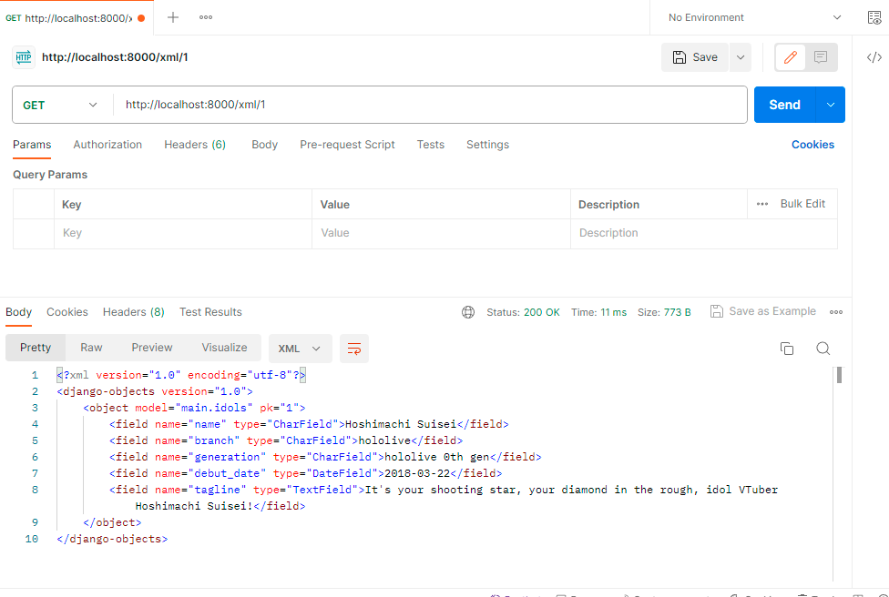

# Holocure Inventory
 
---
# Tugas 1
# Implementasi di *Local Machine*
## Setup Awal
### 1. Pastikan *virtual environment* (venv) sudah aktif
Sebelum membuat *project* Django, kita memerlukan venv untuk menampung semua *library* yang kita gunakan di dalam *project*. Cara untuk mengaktifkan venv adalah sebagai berikut:
- Windows
```
env\Scripts\activate.bat
```
- Mac
```
source env/bin/activate
```

### 2. Jalankan script instalasi *library*
Pada *project* ini, terdapat beberapa *library* yang digunakan demi mempercepat proses pengembangan. Untuk itu, jika ingin menjalankan di *local machine* sendiri, diperlukan untuk menjalankan beberapa *script* berikut:
- Instalasi *library*
```
pip install -r requirements.txt
```
- Instalasi *package*
```
npm i
```
Instalasi *package* tidak diharuskan untuk menggunakan Node Package Manager. *Package manager* lain seperti Yarn dan Bun juga bisa digunakan di *project* ini. Alasan perlu meng-*install* *package* juga padahal sudah ada *library* adalah karena *project* ini menggunakan TailwindCSS sebagai *framework* CSS-nya.

## Langkah Pembuatan *Project*
### 1. Membuat *project* Django baru
Untuk membuat *project* baru, sebelumnya harus dipastikan bahwa direktori terminal sudah sesuai. Jika sudah, perintah berikut dijalankan untuk membuat *project* Django:
```
py manage.py startapp game_inventory .
```
Sebuah aplikasi main juga diperlukan pada *project*. Oleh karena itu, perintah berikut perlu dijalankan juga:
```
py manage.py startapp main .
```

### 2. Konfigurasi *Project*
#### Aplikasi `game_inventory`
Ubah pengaturan `ALLOWED_HOST` agar membolehkan aplikasi untuk dijalankan oleh segala *host* dengan mengubah pengaturan berikut di `settings.py` milik `game_inventory`:
```py
...
ALLOWED_HOSTS = ['*']
...
```

Tambahkan aplikasi `main` sebagai `INSTALLED_APP` di `settings.py` dengan mengubah pengaturan berikut:
```py
INSTALLED_APPS = [
    ...,
    'main',
    'compressor',
    'widget_tweaks',]
```

#### Konfigurasi URL
URL dari index perlu ditambahkan agar ketika membuka halaman, akan terbuka `main.html`. Caranya adalah dengan mengubah `urls.py` pada direktori `main` sebagai berikut:
```py
urlpatterns = [
    path('admin/', admin.site.urls),
    path('', index, name='index')
]
```

### 3. Implementasi Template
#### Membuat Page Utama
Buat direktori baru bernama `templates` dalam direktori utama, bukan direktori *project*. Setelah itu buat berkas baru bernama `main.html` yang isinya adalah halaman utama yang diinginkan. Untuk mendapatkan boilerplate, emmet abbreviation dapat dimanfaatkan dengan hanya menulis `html:5` lalu meng-klik *enter*.

#### Membuat Model
Untuk mengolah data, models dapat menampung sebuah *class* untuk menyimpan data tersebut. Pada *project* ini, data yang akan disimpan adalah *Item* dengan atribut nama, jumlah, tingkat kelangkaan, dan deskripsi yang implementasinya adalah sebagai berikut:
```py
from django.db import models

# Create your models here.
class Item(models.Model):
    name = models.CharField(max_length=32)
    amount = models.IntegerField()
    rarity = models.IntegerField()
    description = models.TextField()
```

#### Membuat View
Untuk menampilkan `main.html`, diperlukan sebuah fungsi pada `view` untuk memberikan file HTML tersebut ke pengguna. Caranya adalah menambahkan fungsi berikut:
```py
from django.shortcuts import render
from django.template import loader
from django.http import HttpResponse

def index(request):
    template = loader.get_template('main.html')
    return HttpResponse(template.render())
```

#### Melakukan Migrasi Model
Migrasi model harus selalu dilakukan setiap kali ada perubahan yang dilakukan pada model. Perintah yang digunakan untuk melakukan migrasi adalah sebagai berikut:
```
python manage.py migrate
```

# Bagan
  

# Mengapa venv?
Terdapat beberapa alasan khusus tentang penggunaan venv untuk pengembangan aplikasi Django, yaitu:
- Pengelolaan *Dependency* — setiap *project* pasti memerlukan versi *package* yang berbeda. Oleh karena itu, agar setiap *project* memiliki *package* yang sesuai dengan versi yang sesuai, lebih baik untuk mengisolasikan *project* tersebut dari instalasi Python secara global.
- Reprodusibilitas — ada kemungkinan bahwa *project* yang dijalankan di suatu komputer justru tidak bisa dijalankan di komputer lainnya. Penyebab utamanya adalah perbedaan versi dari *package* yang dimiliki. Dengan adanya venv, versi dari *package* yang digunakan setiap aplikasi sudah diatur sehingga kemungkinan tidak bisa dijalankan berkurang.

# MVC, MVT, MVVM, dan Perbedaannya
Pada pengembangan website, terdapat beberapa pola arsitektural yang dikembangkan oleh *developer* untuk membuat *project* lebih *scalable* dan mudah untuk di-*maintain*. Ketiga arsitektur yang akan dibahas kali ini adalah beberapa yang paling populer di antara arsitektur-arsitektur yang ada. Ketiganya memiliki dua komponen utama yang memiliki peran krusial dalam arsitektur:
- **Model** — komponen inti dari arsitektur, merupakan struktur data dinamik milik aplikasi yang independen dari *user interface*. Secara langsung mengatur data, logika, dan peraturan dari aplikasi.
- **View** — mengurus logika presentasi, yaitu bagaimana data yang dikelola oleh model akan dipresentasikan kepada pengguna.

Perbedaan pendekatan dari tiap arsitektur mulai terlihat pada komponen ketiga. Masing-masing komponen pembeda pada arsitektur sebenarnya memiliki tujuan sama, namun dengan pendekatan yang berbeda. Berikut adalah penjelasan mengenai perbedaan pendekatan yang digunakan oleh arsitektur-arsitektur di atas.

## Model View Controller (MVC)
Pola arsitektural ini adalah yang paling sering digunakan oleh *framework* pengembangan *website* untuk membuat *project* yang *scalable*. Perbedaan dengan dua arsitektur lainnya terdapat pada komponen ketiganya, *controller*, yaitu:
- **Controller** — bertindak sebagai jembatan antara *model* dan *view* untuk memproses semua *business logic* dan *request* yang datang.

## Model View Template (MVT)
Pola arsitektur yang sering digunakan pada aplikasi website Django, yaitu *framework* Python *high-level*. Memiliki banyak persamaan dengan arsitektur MVC namun terdapat beberapa perbedaan untuk menyesuaikan dengan kebutuhan pengembangan aplikasi website. Perbedaan signifikan yang dimiliki MVT dengan arsitektur lain adalah:
- **View** — pada Django, *view* berisi lebih banyak tentang pemrosesan data dan logika dibandingkan menampilkan suatu hal. Oleh karena itu, bisa dibilang pada arsitektur ini *view* merupakan perpaduan antara *controller* dan *view* pada arsitektur MVC.
- **Template** — berisi bagian statik dari *output* HTML dan juga berbagai sintaks khusus yang menjelaskan bagaimana konten dinamis akan ditampilkan. Perannya mirip seperti *view* pada arsitektur MVC.

## Model View View Model (MVVM)
Pola arsitektural yang sering digunakan pada aplikasi yang memerlukan banyak interaksi pengguna seperti aplikasi *desktop* dan *single page application* dengan *framework* seperti Angular dan Vue. Perbedaan signifikan yang dimiliki MVVM dengan arsitektur lain adalah:
- **View Model** — penengah antara *model* dan *view* yang mengandung logika presentasi dan mengubah data dari model menjadi format yang bisa ditampilkan oleh *view*. 

---
# Tugas 2
# Apa perbedaan `GET` dan `POST` di Django?
Method `GET` dan `POST` merupakan dua method yang paling sering digunakan dalam HTTP untuk berinteraksi dengan sumber daya yang dimiliki server. Berikut adalah 

## Method `GET`
- **Tujuan** — meminta dan mendapatkan data dari sumber tertentu.
- **Visibilitas data** — data dikirim melalui parameter URL. Oleh karena itu, data dapat dilihat di *address bar*.
- **Panjang data** — sebab data dikirim melalui parameter URL, panjang data hanya terbatas terhadap panjang dari URL tersebut.
- **Tipe data** — hanya bisa mengandung karakter ASCII di dalam URL, sehingga memiliki keterbatasan tersebut.
- **Keamanan** — data terlihat pada URL. Oleh karena itu, tidak direkomendasikan untuk mengirim informasi sensitif melalui `GET`.
- **Indepotency** — *request* `GET` berulang kali akan memberikan hasil yang sama.
- **Caching** — *response* dari `GET` selalu di-*cache* kecuali bila dilarang secara eksplisit.
- **Browser behavior** — bisa di *bookmark* dan dipakai ketika bernavigasi menggunakan tombol *backward* atau *forward* di dalam *browser*.

## Method `POST`
- **Tujuan** — mengirim data ke sumber tertentu untuk diproses.
- **Visibilitas data** — mengirim data melalui *body* dari HTTP *request*
- **Panjang data** — tidak memiliki keterbatasan seperti `GET` karena data tidak dikirim melalui URL.
- **Tipe data** —  tidak memiliki keterbatasan seperti `GET` karena data tidak dikirim melalui URL.
- **Keamanan** — data dikirim melalui *request body* sehingga lebih aman dibandingkan dengan `GET`.
- **Indepotency** — *request* `POST` berulang kali akan memberikan hasil yang berbeda.
- **Caching** — biasanya *response* terhadap `POST` tidak di-*cache* kecuali diperintahkan untuk melakukan demikian.
- **Browser behavior** — tidak bisa di-*bookmark*. Jika diakses kembali menggunakan tombol *back* di *browser*, `POST` akan mengirim konfirmasi kepada pengguna untuk mengirim ulang datanya.

# Perbedaan antara HTML, XML, dan JSON
Perbedaan fundamental di antara ketiga jenis file adalah XML dan JSON digunakan untuk menyimpan dan transmisi data, sedangkan HTML digunakan untuk menjelaskan bagaimana data seharusnya ditampilkan.

# Alasan JSON lebih sering digunakan pada web modern
JSON lebih cocok untuk data yang kecil dan sederhana, lebih mudah untuk dibaca dan di-*maintain*, lebih cepat dan efisien untuk aplikasi web atau API, mendukung tipe data *native* yang kurang memiliki standar skema bahasa, dan lebih kompatibel terhadap teknologi *web* namun lebih rentan dibanding XML.

# Langkah pembuatan
## Pembuatan form
Untuk menjaga kerapihan file, kode form ditulis pada file baru bernama `forms.py` yang berada di direktori `main`.
```py
from django import forms
from main.models import Idols

class IdolsForm(forms.ModelForm):
    class Meta:
        model = Idols
        fields = ['name', 'branch', 'generation', 'debut_date', 'tagline']
```
Pada kasus ini, `ModelForm` dipakai sebab berhubungan langsung dengan model **Idols** yang berada pada `models.py`. Untuk menghindari proses yang merepotkan, `ModelForm` lebih tepat digunakan dibanding `Form`.

## Menampilkan form
Setelah kode form dibuat, `views.py` pada direktori `main` perlu diubah agar dapat menampilkan form tersebut.
```py
def add_items(request):
    form = IdolsForm(request.POST or None)

    if form.is_valid() and request.method == "POST":
        form.save()
        return HttpResponseRedirect(reverse('main:show_main'))

    context = {'form': form}
    return render(request, 'add_items.html', context)
```

## Pengembalian data
Untuk membolehkan pengguna mengambil data dari model, diperlukan fungsi dalam `views.py` untuk memberikan data-data tersebut menggunakan format file tertentu.
```py
def show_xml(request):
    data = Idols.objects.all()
    return HttpResponse(serializers.serialize("xml", data), content_type="application/xml")

def show_json(request):
    data = Idols.objects.all()
    return HttpResponse(serializers.serialize("json", data), content_type="application/json")

def show_xml_by_id(request, id):
    data = Idols.objects.filter(pk=id)
    return HttpResponse(serializers.serialize("xml", data), content_type="application/xml")

def show_json_by_id(request, id):
    data = Idols.objects.filter(pk=id)
    return HttpResponse(serializers.serialize("json", data), content_type="application/json")
```

## Konfigurasi URL
`urlpatterns` pada `urls.py` di direktori `main` perlu diubah agar dapat memberikan data yang disajikan oleh fungsi dari `views.py` kepada pengguna.
```py
urlpatterns = [
    ...,
    path('xml/', show_xml, name='show_xml'),
    path('json/', show_json, name='show_json'),
    path('xml/<int:id>/', show_xml_by_id, name='show_xml_by_id'),
    path('json/<int:id>/', show_json_by_id, name='show_json_by_id'), 
]
```

# Akses data melalui URL dengan Postman
## JSON
  

## XML
